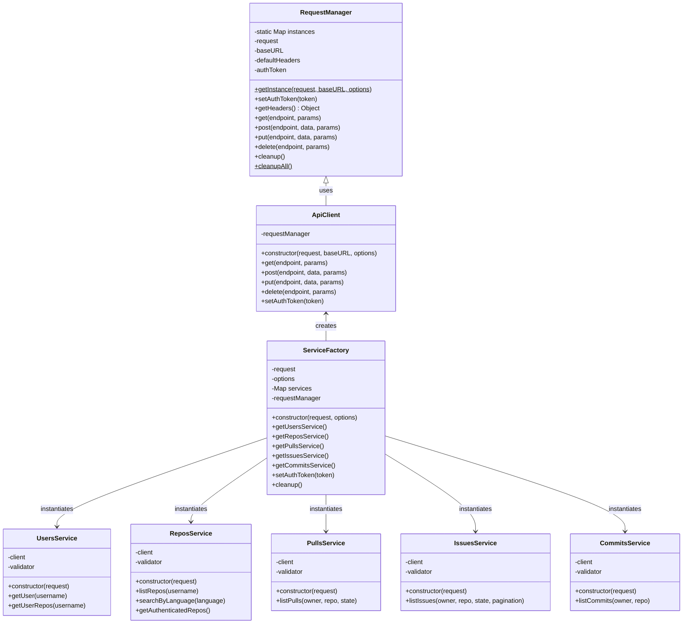
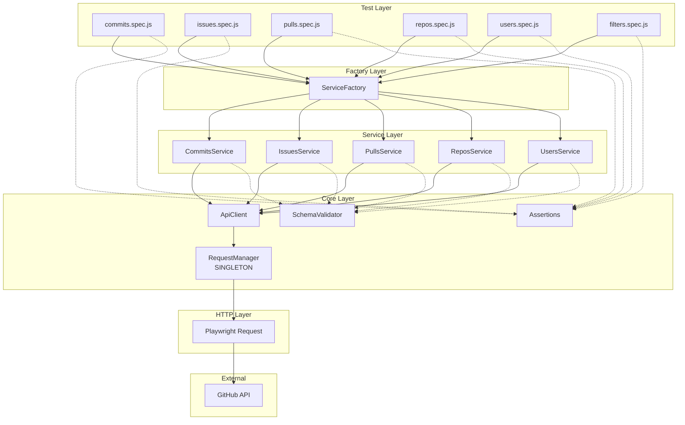
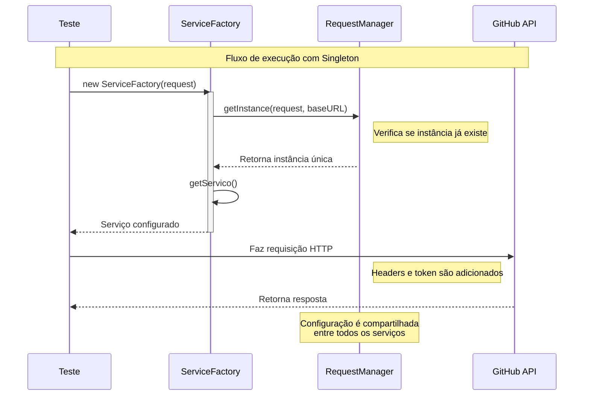

# GitHub API Tests

Projeto de automação de testes de API desenvolvido para a disciplina de Qualidade de Software 3.

## Objetivo

Automatizar testes da API do GitHub utilizando JavaScript e Playwright Test, realizando validações de:

- Status code
- Body da resposta
- Integridade dos dados
- Tipos de parâmetros
- Headers HTTP

## Tecnologias Utilizadas

- JavaScript (ES6+)
- Node.js
- Playwright Test
- Git/GitHub

## Design Patterns Implementados

### 1. Singleton Pattern - RequestManager
O `RequestManager` garante uma única instância do gerenciador de requisições HTTP em toda a aplicação, centralizando:
- Configuração de headers padrão
- Gerenciamento de autenticação (tokens)
- Logging unificado
- Rate limiting

### 2. Factory Pattern - ServiceFactory
O `ServiceFactory` centraliza a criação e gerenciamento de serviços, proporcionando:
- Lazy initialization dos serviços
- Instâncias compartilhadas
- Configuração única para todos os serviços

## Diagrama de Classes



## Diagrama de Arquitetura



## Diagrama de Sequência



## Estrutura do Projeto

```txt
github-api-tests/
│
├── core/                       # Core modules
│   ├── requestManager.js      # Singleton - Gerencia requisições HTTP
│   ├── serviceFactory.js      # Factory - Cria e gerencia serviços
│   ├── apiClient.js           # Cliente HTTP base
│   ├── assertions.js          # Validações de teste
│   └── schemaValidator.js     # Validação de schemas JSON
│
├── services/                   # Service layer
│   ├── usersService.js        # Serviços de usuário
│   ├── reposService.js        # Serviços de repositórios
│   ├── commitsService.js      # Serviços de commits
│   ├── pullsService.js        # Serviços de pull requests
│   └── issuesService.js       # Serviços de issues
│
├── schemas/                    # JSON schemas para validação
│   ├── users.schema.js
│   ├── repos.schema.js
│   ├── commits.schema.js
│   ├── pulls.schema.js
│   └── issues.schema.js
│
├── tests/                      # Test files
│   ├── unit/                  # Unit tests
│   │   └── requestManager.spec.js
│   ├── users.spec.js
│   ├── repos.spec.js
│   ├── commits.spec.js
│   ├── pulls.spec.js
│   ├── issues.spec.js
│   └── filters.spec.js
│
├── fixtures/                   # Test data
│   └── testData.js
│
├── utils/                      # Utilities
│   ├── config.js              # Configurações
│   └── logger.js              # Logging
│
├── .env.example                # Environment variables template
├── package.json
└── playwright.config.js
```

## Instalação

```bash
# Clone o repositório
git clone https://github.com/seu-usuario/github-api-tests.git

# Instale as dependências
npm install

# Instale os browsers do Playwright
npx playwright install
```

## Configuração

### Variáveis de Ambiente

Crie um arquivo `.env` na raiz do projeto:

```env
GITHUB_TOKEN=seu_token_do_github_aqui
```

### Obter Token do GitHub

1. Acesse Settings → Developer settings → Personal access tokens
2. Clique em "Generate new token (classic)"
3. Selecione os escopos necessários (repo, user)
4. Copie o token gerado

## Execução dos Testes

### Comandos Básicos

```bash
# Executar todos os testes
npx playwright test

# Executar testes específicos
npx playwright test tests/users.spec.js


### Com Autenticação

```bash
# Usando token do .env
npx playwright test

# Usando token inline
GITHUB_TOKEN=seu_token npx playwright test
```
### Manutenção de Schemas
#### Por que manter os schemas atualizados?
A API do GitHub evolui constantemente. Manter os schemas sincronizados com a documentação oficial evita:

* Falsos positivos nos testes
* Quebras inesperadas em produção
* Retrabalho na investigação de falhas

#### Script de Atualização Automática
O projeto possui um script que baixa os schemas oficiais da API do GitHub:
```bash
node scripts/fetchSchemas.js
```
Este script:

* Baixa a especificação OpenAPI do GitHub
* Extrai os schemas de usuário, repositório, issues, pulls e commits
* Gera arquivos .auto.json com os schemas oficiais

#### Fluxo de Manutenção 
Executar a cada 2 meses ou quando detectar falhas suspeitas:
```bash
# 1. rodar o script
node scripts/fetchSchemas.js

# 2. Comparar com os schemas atuais
diff schemas/users.schema.js schemas/users.schema.auto.json
diff schemas/repos.schema.js schemas/repos.schema.auto.json
diff schemas/issues.schema.js schemas/issues.schema.auto.json
diff schemas/pulls.schema.js schemas/pulls.schema.auto.json
diff schemas/commits.schema.js schemas/commits.schema.auto.json

``` 

Ai basta comparar para ver se houve alguma alteração na API o github

### Relatórios

```bash
# Gerar relatório HTML
npx playwright test --reporter=html

# Abrir relatório
npx playwright show-report
```

## Integração Contínua (CI/CD)

O projeto está totalmente preparado e configurado com suporte para execução automatizada em pipelines de integração contínua (CI/CD) nativamente através do **[GitHub Actions](.github/workflows/playwright.yml)**.

Para detalhes completos sobre a arquitetura do pipeline, caches de pacotes, configurações de segredos e geração de artefatos na plataforma, consulte a nossa **[Documentação de CI/CD](docs/cicd.md)**.

Para detalhes específicos sobre o processo de automação de execução e estratégias de monitoramento da saúde dos testes, consulte a nossa **[Documentação de Execução e Monitoramento Contínuo](docs/execucao_monitoramento.md)**.

