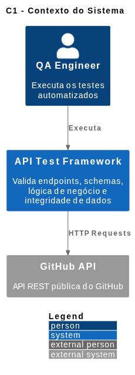
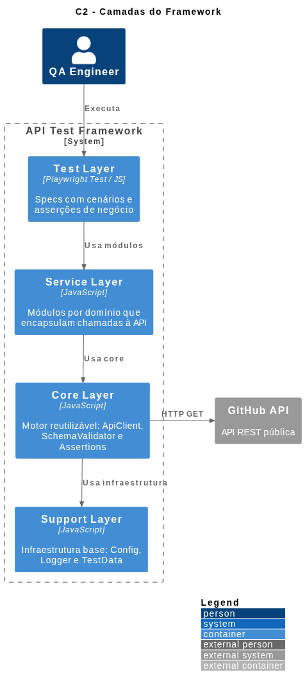
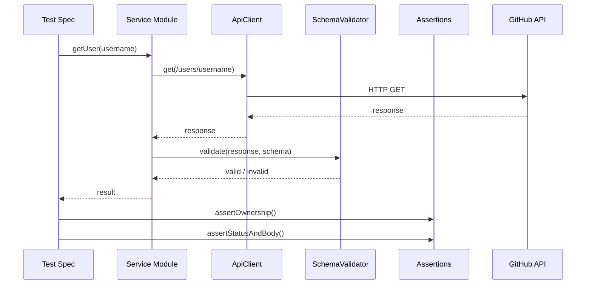
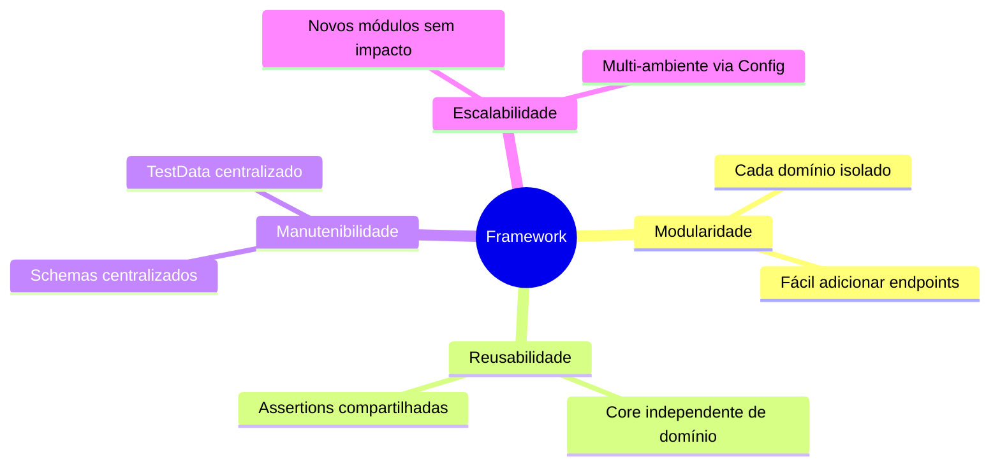

# Arquitetura do Framework

## Estrutura do Projeto

```txt
github-api-tests/
│
├── core/                        ← Core Layer: motor 
│   ├── apiClient.js
│   ├── assertions.js
│   └── schemaValidator.js
│
├── services/                    ← Service Layer: módulos por domínio
│   ├── commitsService.js
│   ├── issuesService.js
│   ├── pullsService.js
│   ├── reposService.js
│   └── usersService.js
│
├── schemas/                     ← Contratos JSON Schema por entidade
│   ├── commits.schema.js
│   ├── issues.schema.js
│   ├── pulls.schema.js
│   ├── repos.schema.js
│   └── users.schema.js
│
├── tests/                       ← Test Layer: specs Playwright
│   ├── commits.spec.js
│   ├── filters.spec.js
│   ├── issues.spec.js
│   ├── pulls.spec.js
│   ├── repos.spec.js
│   └── users.spec.js
│
├── fixtures/                    ← Support Layer: dados de teste
│   └── testData.js
│
├── utils/                       ← Support Layer: infraestrutura
│   ├── config.js
│   └── logger.js
│
├── docs/                        ← Documentação e diagramas
│   └── architecture.md
│
├── playwright.config.js
└── package.json
```

---

## 1. C1 - Contexto do Sistema



---

## 2. C2 - Containers (Camadas)



---

## 3. Fluxo de uma Requisição



---

## 4. Princípios da Arquitetura


